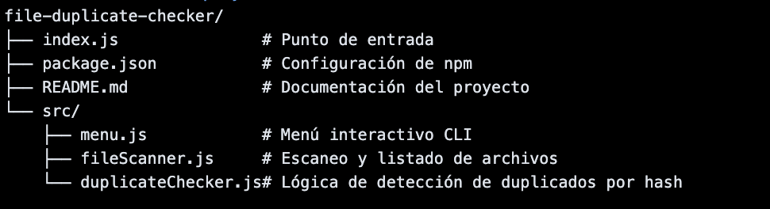

# 🧪 Verificador de Archivos Duplicados con Node.js, Lodash y SHA256

Una aplicación de consola (CLI) que permite escanear un directorio local y detectar archivos duplicados comparando su contenido real mediante hash **SHA256**. Utiliza **Node.js** como motor de ejecución, y **Lodash** para la manipulación eficiente de datos.

---
## 📌 Descripción del problema

En la vida real, es muy común encontrarse con directorios llenos de archivos duplicados, especialmente en entornos como:

- Carpetas de descargas, fotos o backups.
- Proyectos colaborativos con múltiples versiones de archivos.
- Almacenamiento externo o unidades compartidas.

Estos archivos duplicados consumen espacio innecesario, dificultan la organización y pueden llevar a confusiones o errores.

### ❌ Problemas con métodos tradicionales:

- Comparar por **nombre** puede fallar si un archivo fue renombrado.
- Comparar por **tamaño** puede dar falsos positivos: archivos distintos pueden tener el mismo tamaño.

### ✅ Solución robusta:

Comparar el **contenido real** de los archivos usando **hash SHA256**, lo que garantiza una detección precisa de duplicados reales, incluso si tienen nombres diferentes.

---
## 🧰 Tecnologías utilizadas y su justificación

| Tecnología     | Justificación |
|----------------|---------------|
| [Node.js](https://nodejs.org/) | Permite construir una CLI rápida y ligera usando JavaScript. Ideal para trabajar con archivos y consola. |
| [Lodash](https://lodash.com/) | Simplifica tareas como agrupar datos (`groupBy`), filtrar y transformar listas. Mejora legibilidad y rendimiento. |
| `crypto` (módulo nativo) | Se usa para generar hashes SHA256 sin necesidad de librerías externas. Es seguro, rápido y confiable. |
| `fs` y `path` (módulos nativos) | Permiten acceder al sistema de archivos y trabajar con rutas de manera multiplataforma. |

---
## 🏗️ Estructura del proyecto


---
## 🛠️ Instalación (paso a paso)

### 1. Clona el repositorio
```bash
git clone https://github.com/CarlosDanielArauzSanjuan/Taller-NPM-file-duplicate-checker.git
cd Taller-NPM-file-duplicate-checker

```
### 2. Instala las dependencias
```bash
npm install

```
Esto instalará lodash y dejará lista la aplicación para ejecutarse.

---
## 🚀 Uso (paso a paso)

### 1. Abre una terminal en el proyecto
```bash
cd file-duplicate-checker

```
### 2. Ejecuta el programa
```bash
node index.js

```
### 3. Verás un menú interactivo como este:
```bash
🧪 Verificador de Archivos Duplicados (Node.js + Lodash)
1. Escanear directorio
2. Buscar archivos duplicados
3. Salir

```
### 4. Opciones disponibles:

	•	Opción 1: Muestra todos los archivos en el directorio actual.
	•	Opción 2: Busca y muestra los archivos duplicados comparando su contenido (hash SHA256).
	•	Opción 3: Finaliza la ejecución del programa.

👨‍💻 Autor

Desarrollado por Daniel Arauz
Con enfoque educativo y profesional usando buenas prácticas de backend con Node.js y desarrollo CLI.

📄 Licencia

MIT © 2025 – Uso libre para fines educativos, comerciales y personales.